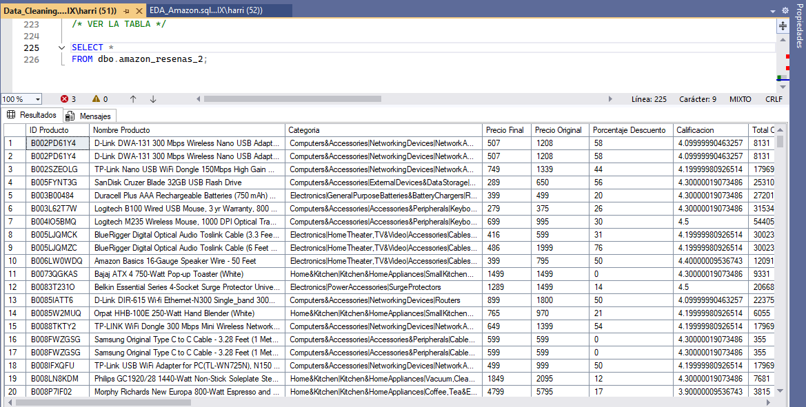

# Análisis Exploratorio de Datos (SQL)

* ¿Qué productos tienen las mejores calificaciones y mayor cantidad de reseñas? (mejor para evitar productos con una sola calificación perfecta) (SQL - POWER BI)
* ¿Existe una relación entre el precio del producto y la calificación otorgada por los usuarios? (PYTHON - POWER BI)
* ¿Los productos con mayores descuentos tienden a recibir mejores calificaciones o más reseñas? (PYTHON - POWER BI)
* ¿Qué categorías presentan, en promedio, mejores calificaciones por parte de los usuarios? (SQL - POWER BI)
* ¿Se observan diferencias significativas en las calificaciones promedio entre distintas marcas? (SQL - POWER BI)
* ¿Cuáles son los productos más populares según la cantidad de reseñas recibidas? (SQL - POWER BI)
* ¿Qué nivel de descuento es más común entre los productos mejor calificados? (SQL - POWER BI)
* ¿Qué categorías tienen los precios más altos y más bajos, y cómo se relacionan con la satisfacción del cliente? (SQL - POWER BI)
* ¿Qué productos presentan mayor diferencia entre el precio original y el precio con descuento? (SQL - POWER BI)
* ¿Existen palabras clave o frases comunes en las reseñas de productos bien valorados? (requiere análisis de texto: NLP básico) (PYTHON)